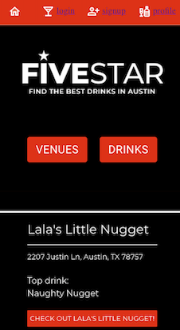

# FiveStar Drinks | 
URL: https://fivestardrinks.herokuapp.com/
<br>
GitHub Repo: https://github.com/samkilpatrick903/fiveStar
<br>
Version 1.0
<br>
Deployment Date: 12/8/2021
<br>
<br>
## Table of Contents:
  1. [Description](#description) 
  2. [User Story](#user-story)
  4. [Technologies](#technologies)
  5. [License](#license) 
  6. [Contributers](#contributers)
  7. [Future Development](#future-development)

## Description
FiveStar Drinks is an intuitive interface that allows users to discover the most popular drinks at various bars and restaurants in Austin, Texas. Users can also add their own drinks that they’ve found to be their favorite.
<br>



## User Story
```
AS A person who likes a good drink in Austin, TX
I WANT to add or view favorite drinks at bars and restaurants
SO THAT I can add my favorites or decide where to go find a new favorite
```

## Technologies
* JavaScript
* MongoDB and the Mongoose ODM
* GraphQL with a Node.js and Express.js server
* React.js
* MUI Component Library
* Heroku 
* JWT Authentication
* GraphQL
* Adobe Illustrator 

## License


## Contributers
* Mary Lou Hoover: [mlh19](https://www.github.com/mlh19) | [ml.hoover@yahoo.com](mailto:ml.hoover@yahoo.com)

* Todd Taylor: [DerTodd](https://github.com/DerTodd) | [todd.taylor@utexas.edu](mailto:todd.taylor@utexas.edu)

* Sam Kilpatrick: [samkilpatrick903](http://github.com/samkilpatrick903) | [samkilpatrick903@gmail.com](mailto:samkilpatrick903@gmail.com)

* Nathan Delman: [Delmanat3](https://github.com/Delmanat3) | [delman.nathan832@gmail.com](delman.nathan832@gmail.com)

* Brooke Jones: [jones406](https://github.com/jones406) | [Brookejones406@gmail.com](Brookejones406@gmail.com )

## Future Development
* Styling results page
* Find a good API for drinks and/or menus to seed db, or refocus the app to be crowd-sourced data and promote it for growth
* Display user favorites on the profile page
* After sign in, re-render nav so it doesn’t show sign up or log-in, but instead log-out
* Validate restaurant and drink name to prevent duplicates.
* Expand the search outside of Austin.
* Users can search and see if their favorites match another person’s favorites.
* Add and monitor reviews, message board/chat, comment on reviews.
