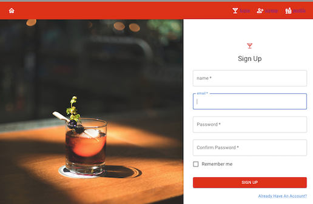

# FiveStar Drinks | 
* URL:
* Version 1.0
* Deployment Date: 12/8/2021

## Table of Contents:
  1. [Description](#description) 
  2. [User Story](#usage)
  4. [Technologies](#technologies)
  5. [License](#license) 
  6. [Contributers](#contributers) 
  7. [Screenshots](#screenshots)
  8. [Other](#other)

## Description

FiveStar Drinks is an intuitive interface that allows users to discover new drinks from various bars and restaurants in Austin, Texas, that other users have found to be amazing. Similarly, users can also add their own drinks that they’ve found to be their favorite.
 
This project is not meant to run locally. The project has been deployed on heroku and can be found here! There are no additional requirements to sign up. Simply make an account and enjoy!

## User Story

```
AS A person who likes a good drink in Austin, TX
I WANT to add or view favorite drinks at bars and restaurants
SO THAT I can share my favorites or decide where to go find a new favorite
```

## Technologies

* JavaScript
* MongoDB and the Mongoose ODM
* GraphQL with a Node.js and Express.js server
* React.js
* Node.js 
* MUI Component Library
* Heroku 
* JWT Authentication
* GraphQL
* Adobe Illustrator 


## License


## Contributers

Mary Lou Hoover: [mlh19](https://www.github.com/mlh19) | [ml.hoover@yahoo.com](mailto:ml.hoover@yahoo.com)

Todd Taylor: [DerTodd](https://github.com/DerTodd) | [todd.taylor@utexas.edu](mailto:todd.taylor@utexas.edu)

Sam Kilpatrick: [samkilpatrick903](http://github.com/samkilpatrick903) | [samkilpatrick903@gmail.com](mailto:samkilpatrick903@gmail.com)

Nathan Delman: [Delmanat3](https://github.com/Delmanat3) | [delman.nathan832@gmail.com](delman.nathan832@gmail.com)

Brooke Jones: [jones406](https://github.com/jones406) | [Brookejones406@gmail.com](Brookejones406@gmail.com )

## Screenshots
<br>


<br>


